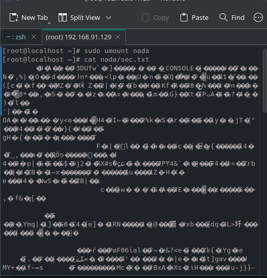

# ECRYPTFS Lab

<p align="justify">

### **What is eCryptFS?**

ECRYPTFS (Enterprise Cryptographic Filesystem) is an open-source file-based encryption tool for
Linux, which provides on-the-fly encryption for individual files or directories.

It is designed to be transparent to the user, allowing them to access and use encrypted files and
directories just like normal files and directories.

With this information, we are set to dive into the installation and use of eCryptFS.

</p>
<hr> 

## installation Steps 


**Step 1: Install eCryptFS on Linux**

eCryptFS is available in many Linux distros’ default repositories and can be installed with the below commands:

```shell
$ sudo yum install epel-release
$ sudo yum install ecryptfs-utils
```

**Step 2: Encrypt Directories With eCryptfs On Linux**

With eCryptfs installed on your Linux system, we are set to encrypt directories. the general syntax to encrypt a directory with eCryptfs is:

```
$ mount -t ecryptfs [source directory] [Destintaion directory]
```

You are required to replace the Destination directory with your own directory. Let’s take a practical example using the directory `/nada` on my system. The command here will be:

```
$ sudo mount -t ecryptfs nada/ nada/
```

You will enter other information to encrypt your directory.


**Step 3: Verify the Encryption**

With these steps correctly done, your directory will be encrypted and mounted. You can verify this by issuing the command.

```
$ mount | grep ecryptfs
```

Sample Output for the above command:

```
/root/nada on /root/nada type ecryptfs (rw,relatime,ecryptfs_sig=a86aa8cc028ab5db,ecryptfs_cipher=aes,ecryptfs_key_bytes=16,ecryptfs_unlink_sigs)

```
**Step 4: Unmounting the Encrypted Directory**


Dive further into verification by creating a file. Let’s say a `sec.txt` file in the encrypted folder then in the file add a simple text, finally try and read the contents of the file using the cat command.

```
$ cd nada
$ touch sec.txt
$ echo "Sec File" > sec.txt
$ cat sec.txt 
Sec File
```

This file is encrypted but still, you can view the content because it is mounted. On is able to view the contents as long as the file is mounted. When you unmount it, the file contents cannot be viewed.

Let’s verify it by unmounting the mounted directory. the syntax used is:

```
$ sudo umount [mounted_directory]
```

In our case, the command will be:

```
$ sudo umount nada/
```

With the directory now unmounted, we will try and view the contents of the file using the similar command we used above.

```
$ cat sec.txt
```
Sample Output:



To view the file, you will now need to remount the directory in different directory `abuzaid` and enter the same passphrase you used before while mounting it.

```
$ sudo mount -t ecryptfs nada/ abuzaid/
```

Now, You can view the contents of the file again.

```
$ cat sec.txt
Sec File
```

**Step 5: Record the above steps in a short video**

Video Link <a href="/">Here</a>